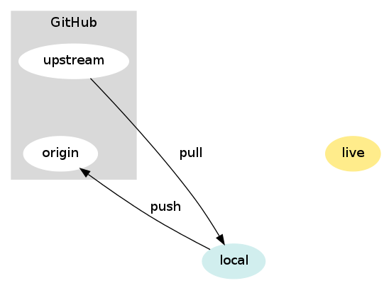
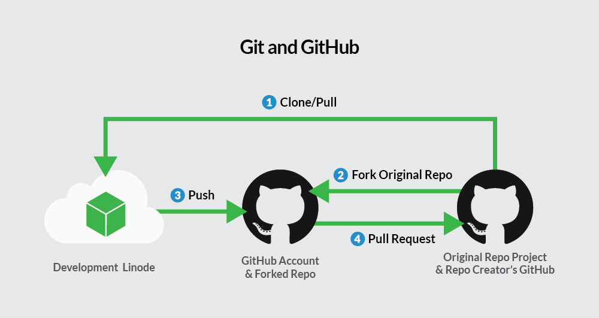

# gitBootcamp: Open Source Contribution 

### git origin 

* Origin 
   - is the name used for the remote repository.
   <p align="center"><a href="./Origin-upstream.png" target="_blank">Origin</a></p>

* Master 
  - is the name of the branch
    master is the default branch, while origin refers to the repo you will push to or you have cloned.

* what is remote repository
 - your project that is hosted on a server, separate from your local machine. 
    It serves as a central location where multiple developers can collaborate on a project. 
    Remote repositories enable you to share your changes with others, fetch updates from others, and collaborate on a codebase.

    - Fetch: fetch only downloads new data from a remote repository 
           - but it doesn't integrate any of this new data into your working files. 
           - Fetch is great for getting a fresh view on all the things that happened in a remote repository.
            ```bash
            git fetch origin
            ```
            

  - Cloning: When you clone a Git repository from a remote, you create a local copy of that repository on your machine. 
    ```bash
    git clone git@github.com:romanofficial/GitBootcamp.git
    ```

  - Push : you can push those changes to the remote repository to share them with others.
    ```bash
    git push origin master
    ```

  - Pull: you can pul changes from the remote repository to update your local copy
        : pull command is used to fetch and download content from a `remote repository`
    ```bash
    git pull origin master
    ```


   - Origin
```bash
git push origin master/main
```
   - the remote repository will be referred to as "origin.
```bash
git clone git@github.com:romanofficial/GitBootcamp.git
```
```bash
git remote add origin https/ssh
```

* the remote repositories associated with your local repository
    ```bash
        git remote -v
    ```

[`origin VS master`](https://stackoverflow.com/questions/58994107/git-branches-naming-standards-origin-origin-master-origin-master)


### git fork 
 - a copy of an existing repository
 - A fork often occurs when a developer becomes dissatisfied with the direction of a project (Direction is given through a pull request)
 
 [Fork](https://chedyhammami.medium.com/git-clone-vs-fork-in-github-610f158d61e3)


 ### Git upstream

```bash
git remote -v
origin  git@github.com:romanofficial/GitBootcamp.git (fetch)
origin  git@github.com:romanofficial/GitBootcamp.git (push)
```
```bash
git remote add upstream git@github.com:romanofficial/GitBootcamp.git
git remote -v
    origin  git@github.com:romanofficial/GitBootcamp.git (fetch)
    origin  git@github.com:romanofficial/GitBootcamp.git (push)
    upstream  git@github.com:romanofficial/GitBootcamp.git (fetch)
    upstream  git@github.com:romanofficial/GitBootcamp.git (push)
```

* Upstream branch is a remote branch that is tracked by a local tracking branch. 
    - Remote branch is called Upstream of the local branch. 
    - All the changes of this remote branch can be pulled by the local branch and, the local branch can push changes to the upstream

```bash
git pull upstream main
```

- git pull upstream main is used to fetch changes from the "upstream" remote repository and automatically merge them into your local branch (typically the main branch)


 ### git pull
    - Updates your current local branch with the latest changes from the remote repository

    ```bash
    git pull [remote] [branch]
    ```

    - If you're working in a team and someone else has pushed to the branch in the meantime, 
    you might need to pull changes before pushing your new commits. In that case, you can use

    ```bash
    git pull origin your-branch
    git push origin your-branch
    ```
    - This ensures that you incorporate changes from the remote repository before pushing your new commits.

  <p align="center"><a href="./1_Fl.png" target="_blank">git pull</a></p>


  ### git diff
  To see the differences between two branches in Git

  Install Meld
  ```bash
  sudo apt-get install meld
  ```

  Configure Git to Use Meld:
  ```bash
  git config --global diff.tool meld
  git config --global difftool.meld.path meld
  ```

  To see the differences between two branches in Git
  ```bash
  git diff branch1..branch2
  ```

  Differences in a side-by-side view
  ```bash
  git difftool -y branch1..branch2
  ```
  <p align="center"><a href="Screenshot from 2023-12-21 08-11-09.png" target="_blank"></a></p>